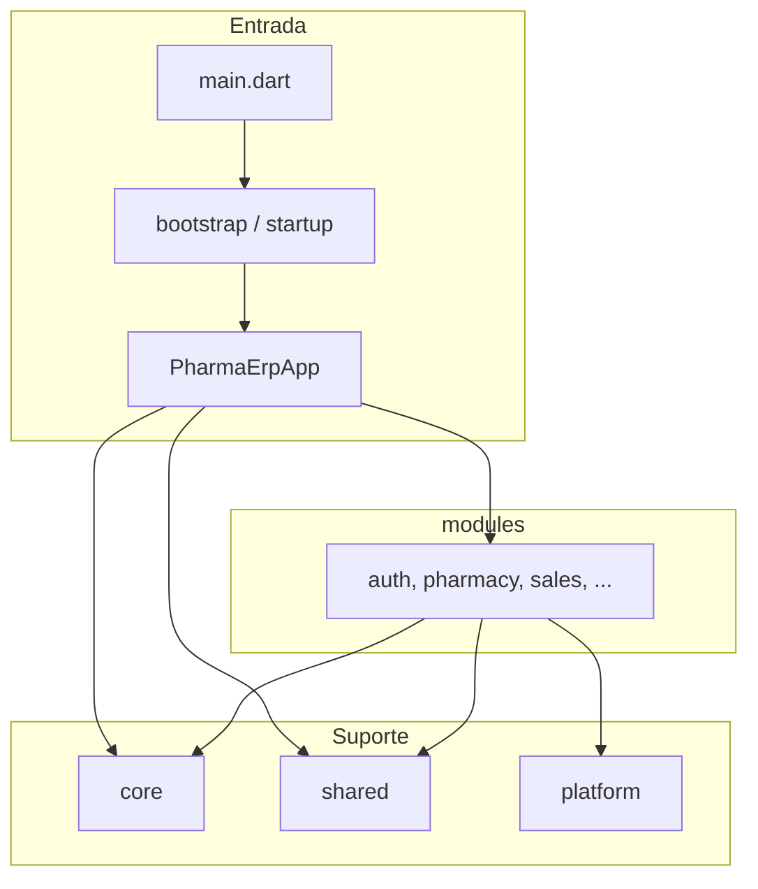

# Estrutura do projecto Pharma ERP

Este documento descreve a organização do código Flutter do **pharma_erp**: responsabilidades de cada pasta, fluxo de arranque da aplicação e orientações para evoluir o projecto sem misturar camadas.

---

## Visão geral

O código Dart vive em **`lib/`**. A ideia é separar em quatro grandes áreas:

| Área | Pasta | Função |
|------|--------|--------|
| Arranque e casca da app | `lib/app/` | `MaterialApp`, rotas, guards, providers globais, tarefas de startup |
| Fundação técnica partilhada | `lib/core/` | Config, rede, erros, tema, storage, sync, contratos — sem regras de negócio de um módulo específico |
| Negócio por domínio | `lib/modules/` | Auth, farmácia, vendas, stock, etc., tipicamente em camadas data / domain / presentation |
| UI e dispositivo reutilizáveis | `lib/shared/` e `lib/platform/` | Componentes de ecrã, layouts; impressão, código de barras, biometria |

**Regra prática:** módulos podem depender de `core`, `shared` e `platform`. O `core` **não** deve importar `modules`. `shared` não deve importar módulos concretos (só `core` genérico, se necessário).

---

## Ponto de entrada

```
lib/main.dart
    → app/bootstrap.dart (WidgetsFlutterBinding + StartupService)
    → app/app.dart (PharmaErpApp: MaterialApp, tema, rotas)
```

- **`main.dart`**: apenas `runApp` dentro do `bootstrap`.
- **`app/bootstrap.dart`**: garante binding Flutter e executa o arranque antes do primeiro frame.
- **`app/startup/`**: `StartupService` orquestra `StartupTasks` (inicializar Hive, variáveis de ambiente, DI, etc., à medida que forem implementados).

---

## `lib/app/` — raiz da aplicação

| Ficheiro / pasta | Responsabilidade |
|------------------|------------------|
| `app.dart` | Widget raiz (`MaterialApp`, tema, `navigatorObservers`, `onGenerateRoute`). |
| `bootstrap.dart` | Sequência síncrona/assíncrona antes de `runApp`. |
| `app_observer.dart` | `NavigatorObserver` global (analytics, logging de navegação). |
| `router/` | `go_app_router.dart` (GoRouter), `routes.dart` (paths), `route_names.dart`; `guards/` (`auth_guard`, `permission_guard`, `tenant_guard`) para condicionar navegação ou acções. |
| `providers/` | Estado global de app: auth, sessão, tema, conectividade, endpoint, WebSocket. |
| `startup/` | Serviço e lista de tarefas de inicialização. |

Os **providers** aqui são pensados para serem registados no topo da árvore (ex.: `MultiProvider`, `ProviderScope`, etc.) quando integrarem a solução de estado escolhida.

---

## `lib/core/` — fundação global

### `config/`

Ambiente (`env.dart`), configuração agregada (`app_config.dart`) e feature flags (`feature_flags.dart`).

### `theme/`

Tema Material (`app_theme.dart`), cores, tipografia, espaçamentos e dimensões de componentes.

### `network/`

- **`dio/`**: cliente HTTP, fábrica, interceptors (auth, tenant, logging, retry, conectividade).
- **`connectivity/`**: verificação de rede, gestão de ligação, resolução de endpoints, estado e monitorização.

### `realtime/`

WebSocket: serviço, eventos, canais e dispatcher de mensagens.

### `sync/`

Motor de sincronização híbrida (offline/online): fila, worker, scheduler, política de retry, conflitos, operações pendentes e estado.

### `storage/`

- **`hive/`**: inicialização e nomes de caixas.
- **`cache/`**: gestão de cache em memória/disco e políticas.
- **`queue/`**: fila offline genérica e itens.
- **`session/`**: persistência de sessão.

### `security/`

Encriptação, armazenamento seguro, permissões e biometria ao nível de serviço core.

### `errors/` e `logging/`

Exceções, falhas, falhas de API, tratamento centralizado; serviços de log, crash e rede.

### `contracts/`

Tipos partilhados de API (`ApiResponse`, paginação, pedidos base).

### `constants/`

Constantes da app, da API e de storage (chaves, timeouts, rotas públicas, etc.).

### `utils/`, `mixins/`, `enums/`

Validadores, formatters, extensions, helpers; mixins e enums transversais.

### `base/`

Contratos e tipos base: entidades (`base_entity`, `sync_entity`), repositório e datasource abstratos — ponto de partida para camadas data/domain dos módulos.

---

## `lib/modules/` — módulos de negócio

Cada domínio (ex.: `auth`, `pharmacy`, `sales`) deve manter-se o mais **autónomo** possível.

### Padrão sugerido por módulo

- **`data/`**: datasources (remoto/local), models, implementações de repositórios.
- **`domain/`**: entidades, interfaces de repositório, casos de uso.
- **`presentation/`**: páginas, widgets, diálogos, providers/controllers de UI.
- **`services/`**: orquestração específica do módulo (ex.: sessão de auth, sessão de PDV).
- **`routes/`** e **`*_module.dart`**: registo de rotas e dependências do módulo.

### Módulos previstos na árvore (resumo)

- **`auth/`**: autenticação e sessão.
- **`dashboard/`**: painéis (executivo, finanças, stock, farmácia).
- **`pharmacy/`**: produtos (com `engine/` de preços e código de barras), receitas, psicotrópicos, lotes (FEFO, validade, alocação), saneamento, incineração.
- **`sales/`**: PDV (motores de carrinho, preços, descontos, pagamento, recibo, stock, impostos), clientes, facturas.
- **`stock/`**: inventário, movimentos, requisições, ajustes.
- **`finance/`**: fluxo de caixa, despesas, relatórios, tesouraria.
- **`audit/`**: logs de actividade, entidades, timeline, psicotrópicos.
- **`users/`**, **`settings/`**: gestão de utilizadores e configurações.

Pastas vazias podem conter `.gitkeep` até existirem ficheiros Dart.

---

## `lib/platform/` — capacidades do dispositivo

Integrações nativas ou por plugin: impressão térmica (incluindo descoberta e ligação), leitor de código de barras, câmara, Bluetooth, notificações, biometria. O código aqui deve ser **fino**: adaptar o plugin e expor interfaces simples para `modules` ou `core`.

---

## `lib/shared/` — UI reutilizável

Layouts (app, auth, dashboard, POS, tablet), widgets por categoria (botões, formulários, tabelas, etc.), responsividade (`breakpoints`, `responsive_builder`), navegação partilhada e animações.

### Feedback do utilizador (`PharmaFeedback`)

Notificações e diálogos centralizados em `lib/shared/widgets/feedback/`. Os módulos devem usar **apenas `PharmaFeedback`** — nunca importar QuickAlert directamente.

| Método | Canal | Quando usar |
|--------|-------|-------------|
| `success`, `error`, `info`, `warning` | SnackBar | Feedback rápido, não bloqueante |
| `confirm`, `criticalError`, `alertWarning`, `loading` | QuickAlert (interno) | Confirmações e erros críticos |
| `showForm`, `confirmComplex` | Dialog Material | Formulários e confirmações com conteúdo rico |

Guia completo: [docs/pharma_feedback.md](pharma_feedback.md).

---

## Pastas auxiliares em `lib/`

| Pasta | Uso |
|-------|-----|
| `generated/` | Código gerado (ex.: `build_runner`, json_serializable). |
| `l10n/` | ARB e recursos de internacionalização geridos pelo Flutter. |

---

## Raiz do repositório (fora de `lib/`)

| Item | Uso |
|------|-----|
| **`assets/`** | `images/`, `icons/`, `fonts/`, `translations/` — declarados em `pubspec.yaml`. |
| **`.env`** | Variáveis locais; está no **`.gitignore`** para não versionar segredos. |
| **`test/`** | Testes unitários e de widget. |
| **`integration_test/`** | Testes de integração (ex.: `integration_test/app_test.dart`). |
| **`pubspec.yaml`** | Dependências e configuração Flutter. |
| **`analysis_options.yaml`** | Regras do analisador e lints. |

---

## Fluxo de dependências (resumo)



---

## Índice em árvore (`lib/`)

Árvore de pastas e ficheiros (profundidade 5), gerada com `tree -L 5 lib` na raiz do repositório. Pastas vazias ou só com `.gitkeep` aparecem como ramos sem ficheiros listados.

*Versão em inglês desta documentação (incluindo a mesma árvore): [project_structure.md](project_structure.md).*

```
lib
├── app
│   ├── app.dart
│   ├── app_observer.dart
│   ├── bootstrap.dart
│   ├── providers
│   │   ├── auth_provider.dart
│   │   ├── connectivity_provider.dart
│   │   ├── endpoint_provider.dart
│   │   ├── session_provider.dart
│   │   ├── theme_provider.dart
│   │   └── websocket_provider.dart
│   ├── router
│   │   ├── go_app_router.dart
│   │   ├── guards
│   │   │   ├── auth_guard.dart
│   │   │   ├── permission_guard.dart
│   │   │   └── tenant_guard.dart
│   │   ├── route_names.dart
│   │   └── routes.dart
│   └── startup
│       ├── startup_service.dart
│       └── startup_tasks.dart
├── core
│   ├── base
│   │   ├── base_datasource.dart
│   │   ├── base_entity.dart
│   │   ├── base_repository.dart
│   │   └── sync_entity.dart
│   ├── config
│   │   ├── app_config.dart
│   │   ├── env.dart
│   │   └── feature_flags.dart
│   ├── constants
│   │   ├── api_constants.dart
│   │   ├── app_constants.dart
│   │   └── storage_constants.dart
│   ├── contracts
│   │   ├── api_response.dart
│   │   ├── base_request.dart
│   │   └── pagination_response.dart
│   ├── enums
│   ├── errors
│   │   ├── api_failures.dart
│   │   ├── error_handler.dart
│   │   ├── exceptions.dart
│   │   └── failures.dart
│   ├── logging
│   │   ├── crash_logger.dart
│   │   ├── logger_service.dart
│   │   ├── network_logger.dart
│   │   └── sync_logger.dart
│   ├── mixins
│   ├── network
│   │   ├── connectivity
│   │   │   ├── connection_manager.dart
│   │   │   ├── connection_status.dart
│   │   │   ├── endpoint_resolver.dart
│   │   │   ├── network_checker.dart
│   │   │   └── network_monitor.dart
│   │   └── dio
│   │       ├── dio_client.dart
│   │       ├── dio_factory.dart
│   │       └── interceptors
│   │           ├── auth_interceptor.dart
│   │           ├── connectivity_interceptor.dart
│   │           ├── logging_interceptor.dart
│   │           ├── retry_interceptor.dart
│   │           └── tenant_interceptor.dart
│   ├── realtime
│   │   ├── socket_channels.dart
│   │   ├── socket_dispatcher.dart
│   │   ├── socket_events.dart
│   │   └── websocket_service.dart
│   ├── security
│   │   ├── biometric_service.dart
│   │   ├── encryption_service.dart
│   │   ├── permission_manager.dart
│   │   └── secure_storage.dart
│   ├── storage
│   │   ├── cache
│   │   │   ├── cache_manager.dart
│   │   │   ├── cache_policy.dart
│   │   │   ├── disk_cache.dart
│   │   │   └── memory_cache.dart
│   │   ├── hive
│   │   │   ├── hive_boxes.dart
│   │   │   └── hive_initializer.dart
│   │   ├── queue
│   │   │   ├── offline_queue.dart
│   │   │   └── queue_item.dart
│   │   └── session
│   │       └── session_storage.dart
│   ├── sync
│   │   ├── conflict_resolver.dart
│   │   ├── pending_operation.dart
│   │   ├── retry_policy.dart
│   │   ├── sync_dispatcher.dart
│   │   ├── sync_engine.dart
│   │   ├── sync_logger.dart
│   │   ├── sync_queue.dart
│   │   ├── sync_scheduler.dart
│   │   ├── sync_status.dart
│   │   └── sync_worker.dart
│   ├── theme
│   │   ├── app_colors.dart
│   │   ├── app_theme.dart
│   │   ├── dimensions.dart
│   │   ├── spacing.dart
│   │   └── typography.dart
│   └── utils
│       ├── extensions
│       ├── formatters
│       ├── helpers
│       └── validators
├── generated
├── l10n
├── main.dart
├── modules
│   ├── audit
│   │   ├── activity_logs
│   │   ├── entity_logs
│   │   ├── psychotropic_logs
│   │   └── timeline
│   ├── auth
│   │   ├── auth_module.dart
│   │   ├── data
│   │   │   ├── datasources
│   │   │   │   ├── auth_local_datasource.dart
│   │   │   │   └── auth_remote_datasource.dart
│   │   │   ├── models
│   │   │   └── repositories
│   │   │       └── auth_repository_impl.dart
│   │   ├── domain
│   │   │   ├── entities
│   │   │   ├── repositories
│   │   │   │   └── auth_repository.dart
│   │   │   └── usecases
│   │   ├── presentation
│   │   │   ├── controllers
│   │   │   ├── dialogs
│   │   │   ├── pages
│   │   │   ├── providers
│   │   │   └── widgets
│   │   ├── routes
│   │   └── services
│   │       └── auth_session_service.dart
│   ├── dashboard
│   │   ├── executive
│   │   ├── finance
│   │   ├── pharmacy
│   │   └── stock
│   ├── finance
│   │   ├── cashflow
│   │   ├── expenses
│   │   ├── reports
│   │   └── treasury
│   ├── pharmacy
│   │   ├── incineration
│   │   ├── lots
│   │   │   └── engine
│   │   │       ├── expiry_engine.dart
│   │   │       ├── fefo_engine.dart
│   │   │       └── lot_allocator.dart
│   │   ├── prescriptions
│   │   ├── products
│   │   │   ├── data
│   │   │   ├── domain
│   │   │   ├── engine
│   │   │   │   ├── barcode_engine.dart
│   │   │   │   └── price_engine.dart
│   │   │   ├── presentation
│   │   │   │   ├── controllers
│   │   │   │   ├── dialogs
│   │   │   │   ├── pages
│   │   │   │   ├── providers
│   │   │   │   └── widgets
│   │   │   └── services
│   │   │       └── product_search_service.dart
│   │   ├── psychotropics
│   │   │   ├── logs
│   │   │   └── reports
│   │   └── sanitary
│   ├── sales
│   │   ├── customers
│   │   ├── invoices
│   │   └── pdv
│   │       ├── data
│   │       ├── domain
│   │       ├── engine
│   │       │   ├── cart_engine.dart
│   │       │   ├── discount_engine.dart
│   │       │   ├── payment_engine.dart
│   │       │   ├── pricing_engine.dart
│   │       │   ├── receipt_engine.dart
│   │       │   ├── stock_validation_engine.dart
│   │       │   └── tax_engine.dart
│   │       ├── presentation
│   │       │   ├── controllers
│   │       │   ├── dialogs
│   │       │   ├── pages
│   │       │   ├── providers
│   │       │   └── widgets
│   │       └── services
│   │           └── pdv_session_service.dart
│   ├── settings
│   ├── stock
│   │   ├── adjustments
│   │   ├── inventory
│   │   ├── movements
│   │   └── transfers
│   └── users
├── platform
│   ├── barcode
│   │   ├── barcode_listener.dart
│   │   └── barcode_scanner.dart
│   ├── biometrics
│   │   └── biometric_gate.dart
│   ├── bluetooth
│   ├── camera
│   ├── notifications
│   └── printing
│       └── thermal
│           ├── escpos_generator.dart
│           ├── printer_connection.dart
│           ├── printer_discovery.dart
│           ├── printer_manager.dart
│           └── thermal_printer_service.dart
└── shared
    ├── animations
    ├── layouts
    │   ├── app_layout.dart
    │   ├── auth_layout.dart
    │   ├── dashboard_layout.dart
    │   ├── pos_layout.dart
    │   └── tablet_layout.dart
    ├── navigation
    ├── responsive
    │   ├── breakpoints.dart
    │   └── responsive_builder.dart
    └── widgets
        ├── buttons
        ├── cards
        ├── dialogs
        ├── dropdowns
        ├── feedback
        │   ├── pharma_feedback.dart
        │   └── internal
        │       ├── material_dialog_channel.dart
        │       ├── quick_alert_channel.dart
        │       └── snackbar_channel.dart
        ├── forms
        ├── inputs
        ├── loaders
        ├── modals
        └── tables
```

*(Contagem aproximada: dezenas de pastas sob `modules/` e `shared/widgets/` podem conter apenas `.gitkeep` até haver código.)*

---

## Como estender o projecto

1. **Nova funcionalidade de negócio:** criar ou usar um pacote sob `lib/modules/<domínio>/`, respeitando data / domain / presentation.
2. **Novo endpoint ou regra HTTP:** `core/network` + contratos em `core/contracts`; interceptors se for transversal.
3. **Novo ecrã reutilizável:** `lib/shared/widgets` ou `layouts`.
4. **Feedback ao utilizador:** `PharmaFeedback` em `lib/shared/widgets/feedback/` — ver [pharma_feedback.md](pharma_feedback.md).
5. **Hardware ou SO:** `lib/platform/<capacidade>/`.
6. **Estado global da app:** preferir `lib/app/providers/` e ligar no widget raiz em `app.dart`.

---

## Documentação relacionada

- [README principal](../README.md) — como correr o projecto e links rápidos.
- [Project structure (English)](project_structure.md) — mesmo guia em inglês, com a mesma árvore de `lib/`.
- [Feedback do utilizador — PharmaFeedback](pharma_feedback.md) — SnackBar, QuickAlert, Dialog Material.

---

*Última actualização: inclui índice em árvore de `lib/` e ligação à versão em inglês.*
