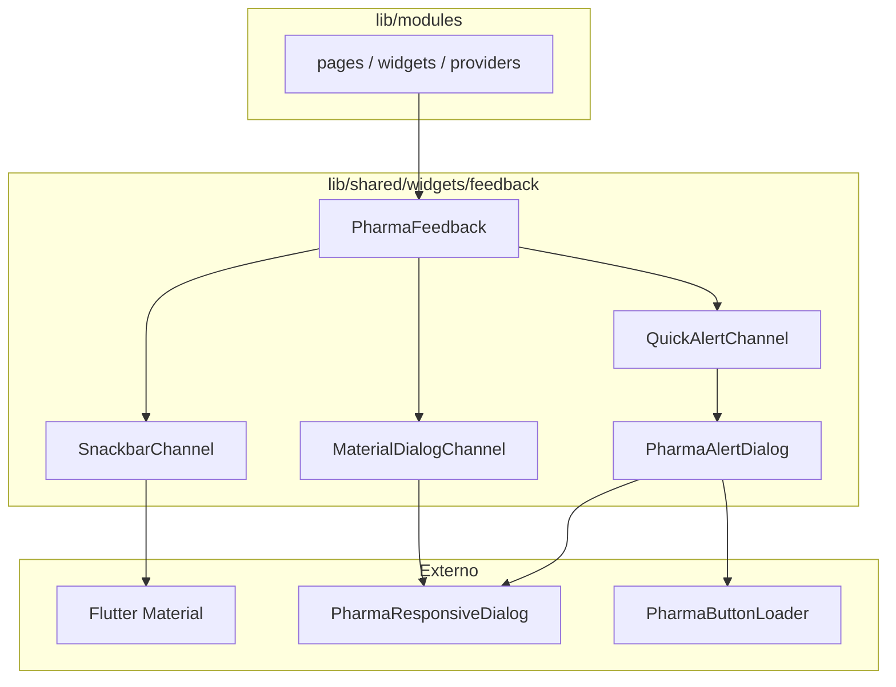

# Feedback do utilizador — `PharmaFeedback`

Camada centralizada de notificações, confirmações e diálogos do frontend Flutter.

*English summary: [project_structure.md](project_structure.md#user-feedback-pharmafeedback).*

---

## Objectivo

Todos os módulos (`lib/modules/`) devem comunicar com o utilizador **apenas** através de `PharmaFeedback`. Os alertas modais usam `PharmaAlertDialog` (design system) via `QuickAlertChannel` — nunca importados directamente nas páginas, widgets ou providers.

Isto garante:

- **Desacoplamento** da biblioteca externa (substituição futura sem tocar nos módulos).
- **Consistência visual** alinhada ao tema `PharmaTokens`.
- **Regras claras** sobre quando usar SnackBar, modal QuickAlert ou Dialog Material.

---

## Estrutura de ficheiros

```
lib/shared/widgets/feedback/
├── pharma_feedback.dart              ← API pública (única entrada)
└── internal/
    ├── quick_alert_channel.dart      ← fachada de alertas modais (delega a PharmaAlertDialog)
    ├── pharma_alert_dialog.dart      ← diálogos responsivos alinhados ao tema
    ├── snackbar_channel.dart         ← SnackBar (Material)
    └── material_dialog_channel.dart  ← Dialog responsivo (PharmaResponsiveDialog)
```

**Regra:** código em `lib/modules/` importa somente:

```dart
import 'package:pharma_erp/shared/widgets/feedback/pharma_feedback.dart';
```

---

## Quando usar cada canal

| Situação | Método | Canal | Bloqueante? |
|----------|--------|-------|-------------|
| Operação concluída (guardar, adicionar ao carrinho) | `PharmaFeedback.success` | SnackBar | Não |
| Erro operacional leve (validação API, listener de provider) | `PharmaFeedback.error` | SnackBar | Não |
| Informação neutra | `PharmaFeedback.info` | SnackBar | Não |
| Aviso leve (campo em falta, selecção obrigatória) | `PharmaFeedback.warning` | SnackBar | Não |
| Confirmar acção (aprovar, cancelar, rejeitar) | `PharmaFeedback.confirm` | PharmaAlertDialog | Sim |
| Erro crítico (login falhou, venda/caixa impossível) | `PharmaFeedback.criticalError` | PharmaAlertDialog | Sim |
| Aviso importante antes de continuar | `PharmaFeedback.alertWarning` | PharmaAlertDialog | Sim |
| Sucesso que exige reconhecimento explícito | `PharmaFeedback.alertSuccess` | PharmaAlertDialog | Sim |
| Operação longa (upload, sync pesado) | `PharmaFeedback.loading` / `dismiss` | PharmaAlertDialog | Sim |
| Formulário (criar requisição, finalizar venda) | `PharmaFeedback.showForm` | Dialog Material | Sim |
| Confirmação com conteúdo rico (detalhes do item) | `PharmaFeedback.confirmComplex` | Dialog Material | Sim |

### Regras práticas

1. **SnackBar** — feedback rápido que não interrompe o fluxo; desaparece sozinho.
2. **PharmaAlertDialog** (via `PharmaFeedback`) — confirmações e erros que **exigem** decisão ou atenção do utilizador; botões via `FilledButton`/`TextButton` do tema global.
3. **Dialog Material** — formulários com vários campos ou confirmações com widgets compostos (listas, detalhes).

**Não fazer:** importar `PharmaAlertDialog` ou `QuickAlertChannel` fora de `lib/shared/widgets/feedback/internal/`.

---

## Referência da API

### Notificações rápidas (SnackBar)

```dart
PharmaFeedback.success(context, 'Produto adicionado ao carrinho.');
PharmaFeedback.error(context, next.errorMessage!);
PharmaFeedback.info(context, 'Sincronização em segundo plano.');
PharmaFeedback.warning(context, 'Selecione um terminal antes de continuar.');
```

### Confirmações e alertas modais (QuickAlert interno)

```dart
// Confirmação — retorna true/false
final confirmed = await PharmaFeedback.confirm(
  context: context,
  title: 'Aprovar requisição',
  message: 'A aprovação regista movimentos documentais. Deseja continuar?',
  confirmText: 'Aprovar',
  cancelText: 'Voltar',
);

// Acção destrutiva
final cancelled = await PharmaFeedback.confirm(
  context: context,
  title: 'Cancelar inventário',
  message: 'Deseja cancelar o inventário activo?',
  confirmText: 'Cancelar inventário',
  destructive: true,
);

// Erro crítico
await PharmaFeedback.criticalError(
  context: context,
  title: 'Falha no início de sessão',
  message: msg,
);

// Loading
await PharmaFeedback.loading(context: context, title: 'A guardar...');
// ... operação async ...
PharmaFeedback.dismiss(context);
```

### Formulários e confirmações complexas (Dialog Material)

```dart
// Formulário com acções customizadas
await PharmaFeedback.showForm<void>(
  context: context,
  title: const Text('Fatura emitida'),
  content: Text('A fatura ${result.numero} foi emitida com sucesso.'),
  actions: [
    TextButton(onPressed: () => Navigator.pop(context), child: const Text('Fechar')),
    FilledButton.icon(/* ... */),
  ],
);

// Confirmação com conteúdo rico
final confirmed = await PharmaFeedback.confirmComplex(
  context: context,
  title: 'Confirmar remoção',
  content: Text(
    'Deseja remover o item "${item.produtoNome}"?\n\n'
    'Lote: ${item.numeroLote ?? '—'}',
  ),
  confirmText: 'Remover',
  destructive: true,
);
```

`showForm` e `confirmComplex` usam internamente `PharmaResponsiveDialog` (`lib/shared/widgets/dialogs/pharma_responsive_dialog.dart`) — layout adaptado a mobile, tablet e desktop.

---

## Fluxo de dependências



---

## Exemplos no projecto

| Módulo | Uso |
|--------|-----|
| `auth/login_page.dart` | `criticalError` quando o login falha |
| `stock/requisicao_stock_flow_view.dart` | `confirm` para aprovar/rejeitar/cancelar; `success`/`error` nos listeners |
| `stock/requisicao_hub_page.dart` | `confirmComplex` para remover item com detalhes |
| `stock/inventory_hub_page.dart` | `confirm` para reconciliar/cancelar inventário |
| `sales/pdv/pdv_page.dart` | `success`/`error` no carrinho; `showForm` pós-checkout |
| `sales/pdv/finalizar_venda_dialog.dart` | `criticalError` se a venda falhar |
| `sales/pdv/abrir_caixa_dialog.dart` | `warning` em validações; `criticalError` ao abrir/fechar caixa |

---

## Substituir alertas modais no futuro

1. Alterar `internal/pharma_alert_dialog.dart` e, se necessário, `internal/quick_alert_channel.dart`.
2. Manter a mesma assinatura pública em `PharmaFeedback` (`confirm`, `criticalError`, `loading`, etc.).
3. Os módulos **não precisam de alteração**.

Métricas de botão centralizadas em `DesignMetrics` (`buttonLoaderSize`, `buttonIconSize`, `feedbackIconSize`) e widget `PharmaButtonLoader` em `lib/shared/widgets/buttons/`.

Para trocar o estilo global dos SnackBars, editar `internal/snackbar_channel.dart`. Para diálogos de formulário, editar `internal/material_dialog_channel.dart` ou `pharma_responsive_dialog.dart`.

---

## Documentação relacionada

- [README](../README.md) — arranque e testes.
- [Estrutura do projecto](estrutura_do_projecto.md) — organização de `lib/shared/`.
- [Project structure (English)](project_structure.md).
