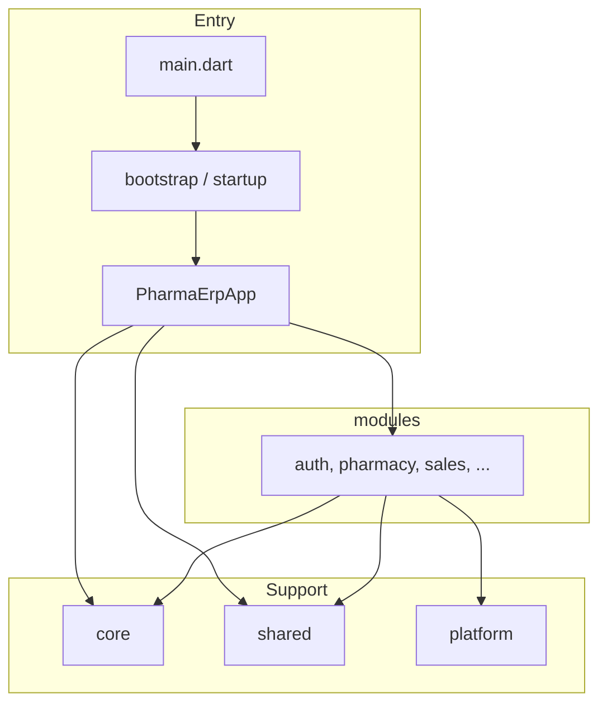

# Pharma ERP — project structure

This document describes how the **pharma_erp** Flutter codebase is organised: folder responsibilities, app bootstrap flow, and how to grow the project without mixing layers.

*Portuguese version: [estrutura_do_projecto.md](estrutura_do_projecto.md).*

---

## Overview

All Dart code lives under **`lib/`**, grouped in four areas:

| Area | Path | Role |
|------|------|------|
| App shell & wiring | `lib/app/` | `MaterialApp`, routing, guards, global providers, startup tasks |
| Shared technical foundation | `lib/core/` | Config, networking, errors, theme, storage, sync, contracts — no domain-specific business rules |
| Business domains | `lib/modules/` | Auth, pharmacy, sales, stock, etc., usually in data / domain / presentation layers |
| Reusable UI & device adapters | `lib/shared/` and `lib/platform/` | Screens, layouts; printers, barcode, biometrics |

**Practical rule:** modules may depend on `core`, `shared`, and `platform`. `core` must **not** import `modules`. `shared` should not import concrete modules (only generic `core` if needed).

---

## Entry point

```
lib/main.dart
    → app/bootstrap.dart (WidgetsFlutterBinding + StartupService)
    → app/app.dart (PharmaErpApp: MaterialApp, theme, routes)
```

- **`main.dart`**: calls `runApp` from `bootstrap`.
- **`app/bootstrap.dart`**: ensures Flutter binding and runs startup before the first frame.
- **`app/startup/`**: `StartupService` runs `StartupTasks` (Hive, environment, DI, … as you implement them).

---

## `lib/app/` — application root

| Path | Responsibility |
|------|----------------|
| `app.dart` | Root widget (`MaterialApp`, theme, `navigatorObservers`, `onGenerateRoute`). |
| `bootstrap.dart` | Sync/async work before `runApp`. |
| `app_observer.dart` | Global `NavigatorObserver` (analytics, navigation logging). |
| `router/` | `go_app_router.dart` (GoRouter), `routes.dart` (paths), `route_names.dart`; `guards/` for auth, permissions, tenant. |
| `providers/` | Global app state: auth, session, theme, connectivity, base URL, WebSocket. |
| `startup/` | Startup service and task list. |

These **providers** are meant to be registered near the top of the widget tree (e.g. `MultiProvider`, `ProviderScope`, …) once you pick a state-management approach.

---

## `lib/core/` — global foundation

### `config/`

Environment (`env.dart`), aggregated settings (`app_config.dart`), feature flags (`feature_flags.dart`).

### `theme/`

Material theme (`app_theme.dart`), colours, typography, spacing, component dimensions.

### `network/`

- **`dio/`**: HTTP client, factory, interceptors (auth, tenant, logging, retry, connectivity).
- **`connectivity/`**: reachability checks, connection handling, endpoint resolution, status, monitoring.

### `realtime/`

WebSockets: service, events, channels, dispatcher.

### `sync/`

Hybrid sync engine (offline/online): queue, worker, scheduler, retry policy, conflicts, pending operations, status.

### `storage/`

- **`hive/`**: init and box names.
- **`cache/`**: memory/disk cache and policies.
- **`queue/`**: generic offline queue and items.
- **`session/`**: session persistence.

### `security/`

Encryption, secure storage, permissions, biometric services at core level.

### `errors/` and `logging/`

Exceptions, failures, API failures, central error handling; logging, crash, and network log sinks.

### `contracts/`

Shared API types (`ApiResponse`, pagination, base requests).

### `constants/`

App-wide, API, and storage constants (keys, timeouts, public routes, …).

### `utils/`, `mixins/`, `enums/`

Validators, formatters, extensions, helpers; cross-cutting mixins and enums.

### `base/`

Shared contracts: entities (`base_entity`, `sync_entity`), abstract repository and datasource — starting point for module data/domain layers.

---

## `lib/modules/` — business modules

Each domain (`auth`, `pharmacy`, `sales`, …) should stay as **self-contained** as possible.

### Suggested layout per module

- **`data/`**: remote/local datasources, models, repository implementations.
- **`domain/`**: entities, repository interfaces, use cases.
- **`presentation/`**: pages, widgets, dialogs, UI providers/controllers.
- **`services/`**: module-specific orchestration (e.g. auth session, POS session).
- **`routes/`** and **`*_module.dart`**: route registration and module wiring.

### Domains in the tree (summary)

- **`auth/`**: sign-in and session.
- **`dashboard/`**: executive, finance, stock, pharmacy dashboards.
- **`pharmacy/`**: products (including pricing/barcode engines), prescriptions, psychotropics, lots (FEFO, expiry, allocation), sanitary, incineration.
- **`sales/`**: POS (cart, pricing, discounts, payment, receipt, stock check, tax engines), customers, invoices.
- **`stock/`**: inventory, movements, transfers, adjustments.
- **`finance/`**: cashflow, expenses, reports, treasury.
- **`audit/`**: activity logs, entity logs, timeline, psychotropic logs.
- **`users/`**, **`settings/`**: user management and configuration.

Empty folders may contain `.gitkeep` until Dart files are added.

---

## `lib/platform/` — device capabilities

Native or plugin integrations: thermal printing (including discovery and connection), barcode scanner / wedge listener, camera, Bluetooth, notifications, biometrics. Keep this layer **thin**: wrap plugins and expose small APIs to `modules` or `core`.

---

## `lib/shared/` — reusable UI

Layouts (app, auth, dashboard, POS, tablet), widgets by category (buttons, forms, tables, …), responsiveness (`breakpoints`, `responsive_builder`), shared navigation, animations.

### User feedback (`PharmaFeedback`)

Centralised notifications and dialogs under `lib/shared/widgets/feedback/`. Modules must use **`PharmaFeedback` only** — never import QuickAlert directly.

| Method | Channel | Use case |
|--------|---------|----------|
| `success`, `error`, `info`, `warning` | SnackBar | Quick, non-blocking feedback |
| `confirm`, `criticalError`, `alertWarning`, `loading` | QuickAlert (internal) | Confirmations and critical errors |
| `showForm`, `confirmComplex` | Material Dialog | Forms and rich confirmations |

Full guide: [docs/pharma_feedback.md](pharma_feedback.md).

---

## Auxiliary folders under `lib/`

| Path | Purpose |
|------|---------|
| `generated/` | Generated Dart (e.g. `build_runner`, json_serializable). |
| `l10n/` | ARB and Flutter-managed localisation. |

---

## Repository root (outside `lib/`)

| Item | Purpose |
|------|---------|
| **`assets/`** | `images/`, `icons/`, `fonts/`, `translations/` — declared in `pubspec.yaml`. |
| **`.env`** | Local variables; listed in **`.gitignore`** so secrets are not committed. |
| **`test/`** | Unit and widget tests. |
| **`integration_test/`** | Integration tests (e.g. `integration_test/app_test.dart`). |
| **`pubspec.yaml`** | Flutter dependencies and configuration. |
| **`analysis_options.yaml`** | Analyser and lint rules. |

---

## Dependency flow (summary)



---

## Directory tree (`lib/`)

Folder and file tree (depth 5), produced with `tree -L 5 lib` from the repository root. Folders that are empty or only contain `.gitkeep` show up as branches without files listed.

```
lib
├── app
│   ├── app.dart
│   ├── app_observer.dart
│   ├── bootstrap.dart
│   ├── providers
│   │   ├── auth_provider.dart
│   │   ├── connectivity_provider.dart
│   │   ├── endpoint_provider.dart
│   │   ├── session_provider.dart
│   │   ├── theme_provider.dart
│   │   └── websocket_provider.dart
│   ├── router
│   │   ├── go_app_router.dart
│   │   ├── guards
│   │   │   ├── auth_guard.dart
│   │   │   ├── permission_guard.dart
│   │   │   └── tenant_guard.dart
│   │   ├── route_names.dart
│   │   └── routes.dart
│   └── startup
│       ├── startup_service.dart
│       └── startup_tasks.dart
├── core
│   ├── base
│   │   ├── base_datasource.dart
│   │   ├── base_entity.dart
│   │   ├── base_repository.dart
│   │   └── sync_entity.dart
│   ├── config
│   │   ├── app_config.dart
│   │   ├── env.dart
│   │   └── feature_flags.dart
│   ├── constants
│   │   ├── api_constants.dart
│   │   ├── app_constants.dart
│   │   └── storage_constants.dart
│   ├── contracts
│   │   ├── api_response.dart
│   │   ├── base_request.dart
│   │   └── pagination_response.dart
│   ├── enums
│   ├── errors
│   │   ├── api_failures.dart
│   │   ├── error_handler.dart
│   │   ├── exceptions.dart
│   │   └── failures.dart
│   ├── logging
│   │   ├── crash_logger.dart
│   │   ├── logger_service.dart
│   │   ├── network_logger.dart
│   │   └── sync_logger.dart
│   ├── mixins
│   ├── network
│   │   ├── connectivity
│   │   │   ├── connection_manager.dart
│   │   │   ├── connection_status.dart
│   │   │   ├── endpoint_resolver.dart
│   │   │   ├── network_checker.dart
│   │   │   └── network_monitor.dart
│   │   └── dio
│   │       ├── dio_client.dart
│   │       ├── dio_factory.dart
│   │       └── interceptors
│   │           ├── auth_interceptor.dart
│   │           ├── connectivity_interceptor.dart
│   │           ├── logging_interceptor.dart
│   │           ├── retry_interceptor.dart
│   │           └── tenant_interceptor.dart
│   ├── realtime
│   │   ├── socket_channels.dart
│   │   ├── socket_dispatcher.dart
│   │   ├── socket_events.dart
│   │   └── websocket_service.dart
│   ├── security
│   │   ├── biometric_service.dart
│   │   ├── encryption_service.dart
│   │   ├── permission_manager.dart
│   │   └── secure_storage.dart
│   ├── storage
│   │   ├── cache
│   │   │   ├── cache_manager.dart
│   │   │   ├── cache_policy.dart
│   │   │   ├── disk_cache.dart
│   │   │   └── memory_cache.dart
│   │   ├── hive
│   │   │   ├── hive_boxes.dart
│   │   │   └── hive_initializer.dart
│   │   ├── queue
│   │   │   ├── offline_queue.dart
│   │   │   └── queue_item.dart
│   │   └── session
│   │       └── session_storage.dart
│   ├── sync
│   │   ├── conflict_resolver.dart
│   │   ├── pending_operation.dart
│   │   ├── retry_policy.dart
│   │   ├── sync_dispatcher.dart
│   │   ├── sync_engine.dart
│   │   ├── sync_logger.dart
│   │   ├── sync_queue.dart
│   │   ├── sync_scheduler.dart
│   │   ├── sync_status.dart
│   │   └── sync_worker.dart
│   ├── theme
│   │   ├── app_colors.dart
│   │   ├── app_theme.dart
│   │   ├── dimensions.dart
│   │   ├── spacing.dart
│   │   └── typography.dart
│   └── utils
│       ├── extensions
│       ├── formatters
│       ├── helpers
│       └── validators
├── generated
├── l10n
├── main.dart
├── modules
│   ├── audit
│   │   ├── activity_logs
│   │   ├── entity_logs
│   │   ├── psychotropic_logs
│   │   └── timeline
│   ├── auth
│   │   ├── auth_module.dart
│   │   ├── data
│   │   │   ├── datasources
│   │   │   │   ├── auth_local_datasource.dart
│   │   │   │   └── auth_remote_datasource.dart
│   │   │   ├── models
│   │   │   └── repositories
│   │   │       └── auth_repository_impl.dart
│   │   ├── domain
│   │   │   ├── entities
│   │   │   ├── repositories
│   │   │   │   └── auth_repository.dart
│   │   │   └── usecases
│   │   ├── presentation
│   │   │   ├── controllers
│   │   │   ├── dialogs
│   │   │   ├── pages
│   │   │   ├── providers
│   │   │   └── widgets
│   │   ├── routes
│   │   └── services
│   │       └── auth_session_service.dart
│   ├── dashboard
│   │   ├── executive
│   │   ├── finance
│   │   ├── pharmacy
│   │   └── stock
│   ├── finance
│   │   ├── cashflow
│   │   ├── expenses
│   │   ├── reports
│   │   └── treasury
│   ├── pharmacy
│   │   ├── incineration
│   │   ├── lots
│   │   │   └── engine
│   │   │       ├── expiry_engine.dart
│   │   │       ├── fefo_engine.dart
│   │   │       └── lot_allocator.dart
│   │   ├── prescriptions
│   │   ├── products
│   │   │   ├── data
│   │   │   ├── domain
│   │   │   ├── engine
│   │   │   │   ├── barcode_engine.dart
│   │   │   │   └── price_engine.dart
│   │   │   ├── presentation
│   │   │   │   ├── controllers
│   │   │   │   ├── dialogs
│   │   │   │   ├── pages
│   │   │   │   ├── providers
│   │   │   │   └── widgets
│   │   │   └── services
│   │   │       └── product_search_service.dart
│   │   ├── psychotropics
│   │   │   ├── logs
│   │   │   └── reports
│   │   └── sanitary
│   ├── sales
│   │   ├── customers
│   │   ├── invoices
│   │   └── pdv
│   │       ├── data
│   │       ├── domain
│   │       ├── engine
│   │       │   ├── cart_engine.dart
│   │       │   ├── discount_engine.dart
│   │       │   ├── payment_engine.dart
│   │       │   ├── pricing_engine.dart
│   │       │   ├── receipt_engine.dart
│   │       │   ├── stock_validation_engine.dart
│   │       │   └── tax_engine.dart
│   │       ├── presentation
│   │       │   ├── controllers
│   │       │   ├── dialogs
│   │       │   ├── pages
│   │       │   ├── providers
│   │       │   └── widgets
│   │       └── services
│   │           └── pdv_session_service.dart
│   ├── settings
│   ├── stock
│   │   ├── adjustments
│   │   ├── inventory
│   │   ├── movements
│   │   └── transfers
│   └── users
├── platform
│   ├── barcode
│   │   ├── barcode_listener.dart
│   │   └── barcode_scanner.dart
│   ├── biometrics
│   │   └── biometric_gate.dart
│   ├── bluetooth
│   ├── camera
│   ├── notifications
│   └── printing
│       └── thermal
│           ├── escpos_generator.dart
│           ├── printer_connection.dart
│           ├── printer_discovery.dart
│           ├── printer_manager.dart
│           └── thermal_printer_service.dart
└── shared
    ├── animations
    ├── layouts
    │   ├── app_layout.dart
    │   ├── auth_layout.dart
    │   ├── dashboard_layout.dart
    │   ├── pos_layout.dart
    │   └── tablet_layout.dart
    ├── navigation
    ├── responsive
    │   ├── breakpoints.dart
    │   └── responsive_builder.dart
    └── widgets
        ├── buttons
        ├── cards
        ├── dialogs
        ├── dropdowns
        ├── feedback
        │   ├── pharma_feedback.dart
        │   └── internal
        │       ├── material_dialog_channel.dart
        │       ├── quick_alert_channel.dart
        │       └── snackbar_channel.dart
        ├── forms
        ├── inputs
        ├── loaders
        ├── modals
        └── tables
```


*(Many folders under `modules/` and `shared/widgets/` may still only hold `.gitkeep` until implementations are added.)*

---

## How to extend

1. **New business feature:** add or extend a package under `lib/modules/<domain>/`, following data / domain / presentation.
2. **New HTTP behaviour:** `core/network` + `core/contracts`; interceptors when cross-cutting.
3. **New reusable screen:** `lib/shared/widgets` or `layouts`.
4. **User feedback:** `PharmaFeedback` in `lib/shared/widgets/feedback/` — see [pharma_feedback.md](pharma_feedback.md).
5. **Hardware or OS feature:** `lib/platform/<capability>/`.
6. **Global app state:** prefer `lib/app/providers/` and register them from `app.dart`.

---

## Related documentation

- [README](../README.md) — how to run the project and quick links.
- [Estrutura do projecto (português)](estrutura_do_projecto.md) — full Portuguese guide (same tree).
- [Feedback do utilizador — PharmaFeedback](pharma_feedback.md) — SnackBar, QuickAlert, Dialog Material.

---

*Last updated to match the `lib/` tree in the pharma_erp repository.*
